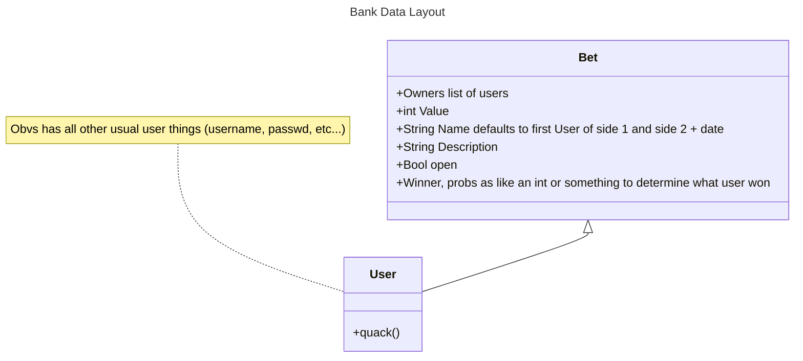

```mermaid
---
title: Bank Data Layout
---
classDiagram
    class User{
        +quack()
    }
    Bet <|-- User
    note for User "Obvs has all other usual user things (username, passwd, etc...)"
    Bet : +Owners list of users
    Bet : +int Value
    Bet : +String Name defaults to first User of side 1 and side 2 + date
    Bet : +String Description
    Bet : +Bool open
    Bet : +Winner, probs as like an int or something to determine what user won
```